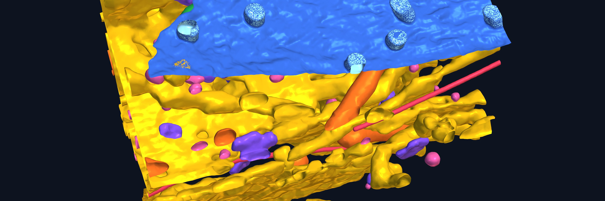

# Alpha Cell — data showcase

A visual showcase of what modern volume electron microscopy data is and what it
makes possible, built for Alpha Cell presentations and discussions. Everything
on the page is real segmented data from the Janelia CellMap / OpenOrganelle
collection — nothing is an illustration.

## How to open it

**The showcase is a single web page: `index.html`.**

- **On your computer**: download or clone this repo, then **double-click
  `index.html`** — it opens in your browser. Everything (3D viewer, meshes,
  movies, charts) is inside the repo, so it works offline with no install and
  no server.
- **On the web**: if GitHub Pages is enabled for this repo, the same page is
  live at the repo's Pages URL — nothing to download.

That's it. No dependencies, no build step.

## What's on the page

1. **Opener** — a two-minute FIB-SEM fly-through of a mosquito stylet, from raw
   EM to the fully segmented reconstruction.
2. **Scale** — one dataset spans six orders of magnitude, from whole tissue to
   the lipid bilayer, with links to fly through the public volumes in
   Neuroglancer.
3. **Resolution** — interactive 3D membrane models at 4–8 nm voxel size (drag,
   zoom, pan).
4. **Quantification** — surfaces colored by measurement (contact gap, curvature,
   protrusions) plus live charts from the analysis: ECS width, contact
   fractions, and an effect-size matrix comparing chemical vs rapid-cryo
   preservation.
5. **Liver zonation & beyond** — an entire acinus with every cell and organelle
   segmented, nuclear pore densities across the tissue, and plasmodesmata in
   plant tissue.
6. **Workflow** — from organ to numbers: tissue → preserve → FIB-SEM → segment
   → measure.
7. **More to explore** — turntable loops (good for slides), all 14 interactive
   models, and a stills gallery.

## Repo contents

| Path | Contents |
| :-- | :-- |
| `index.html` | The whole showcase — self-contained |
| `assets/glb/` | Vertex-colored membrane meshes |
| `assets/video/` | Fly-throughs and turntable loops |
| `assets/img/` | Posters and rendered stills |
| `vendor/` | `<model-viewer>` library (bundled, no CDN) |
| `pipeline/render_meshes.py` | Mesh render pipeline (trimesh + PyVista) |

## Provenance

Meshes and charts come from CellMap ground-truth segmentations of public mouse
datasets (liver, kidney, heart, cortex — chemical vs rapid-cryo preservation),
all browsable on [OpenOrganelle](https://openorganelle.janelia.org). The organelle scenes come from the public [CellMap Segmentation Challenge](https://cellmapchallenge.janelia.org) training data. The
membrane analyses, the stylet reconstruction, and the zonation work are from
manuscripts in preparation — please don't redistribute outside the group for
now. The raw datasets are fully public.
