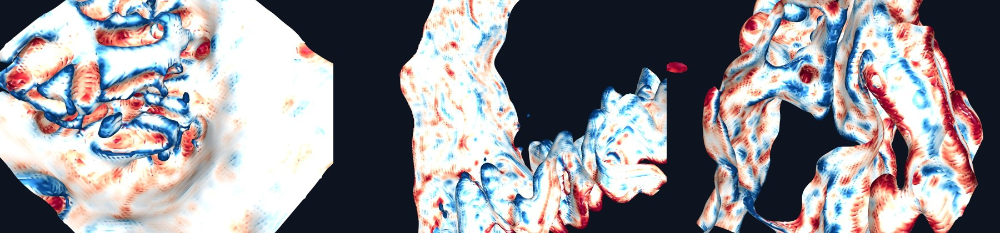
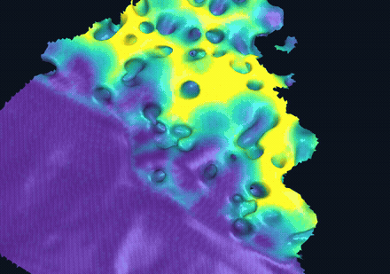
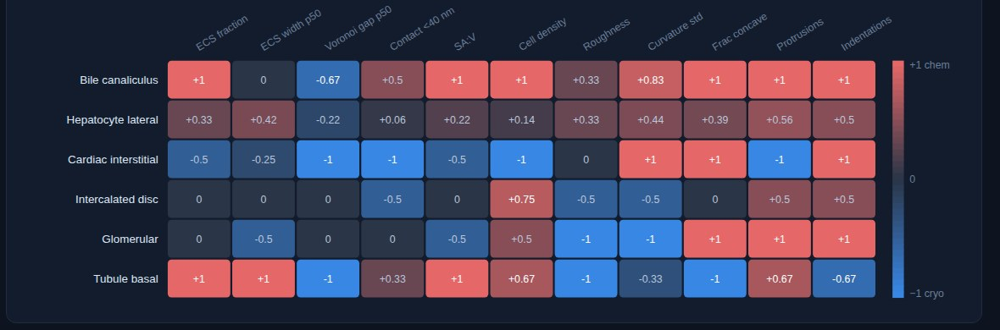

# Alpha Cell — data showcase

A visual showcase of what modern volume electron microscopy data is and what it
makes possible, built for Alpha Cell presentations and discussions. Everything
on the page is real segmented data from the Janelia CellMap / OpenOrganelle
collection — nothing is an illustration.

**Open `index.html`** — it works two ways:

- **Locally**: double-click `index.html`. Everything (viewer library, meshes,
  movie, charts) is in the repo, so it works offline.
- **On the web**: enable GitHub Pages (Settings → Pages → Deploy from branch →
  `main`, root) and share the URL.

<table>
<tr>
<td width="40%"></td>
<td width="60%"></td>
</tr>
<tr>
<td>Every model is interactive on the page — this one is colored by the local distance to the neighboring cell.</td>
<td>And every surface is measurable: the full metric suite, region by region, with per-cell statistics on hover.</td>
</tr>
</table>

## The page, in order

1. **Opener** — a two-minute FIB-SEM fly-through of a mosquito stylet, from raw
   EM to the fully segmented reconstruction.
2. **Scale** — one dataset spans six orders of magnitude, from whole tissue to
   the lipid bilayer; includes links to fly through the public volumes in
   Neuroglancer.
3. **Resolution** — interactive 3D membrane models at 4–8 nm voxel size (drag,
   zoom, pan).
4. **Quantification** — surfaces colored by measurement (contact gap, curvature,
   protrusions) plus live charts built from the analysis results: ECS width,
   contact fractions, and a full effect-size matrix comparing chemical vs
   rapid-cryo preservation.
5. **Workflow** — from organ to numbers: tissue → preserve → FIB-SEM → segment
   → measure.
6. **More to explore** — turntable loops (good for slides), all 14 interactive
   models, and a stills gallery.

## What's inside

| Path | Contents |
| :-- | :-- |
| `index.html` | The whole showcase — self-contained, no CDN, no build step |
| `assets/glb/` | Vertex-colored membrane meshes (glb), ~36 MB |
| `assets/video/` | Stylet fly-through (web transcode) + turntable MP4s |
| `assets/img/` | Posters and rendered stills |
| `vendor/` | `<model-viewer>` UMD build (offline-safe) |
| `pipeline/render_meshes.py` | Render pipeline (trimesh + PyVista): PCA face-on camera, camera lighting, stills + turntables |

## Provenance

Meshes and charts come from CellMap ground-truth segmentations of eight public
mouse datasets (liver, kidney, heart, cortex — chemical vs rapid-cryo
preservation), all browsable on
[OpenOrganelle](https://openorganelle.janelia.org). The membrane analyses and
the stylet reconstruction are from manuscripts in preparation — please don't
redistribute outside the group for now. The raw datasets are fully public.
